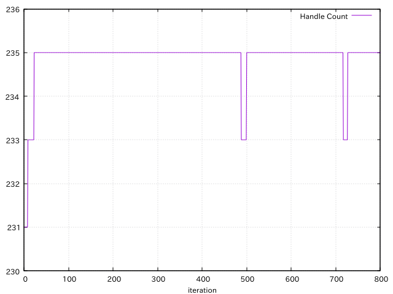
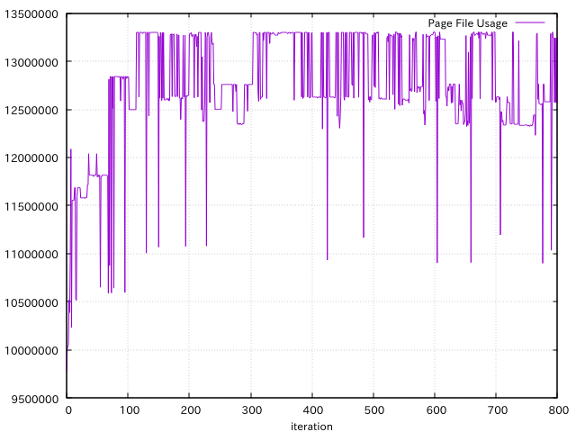
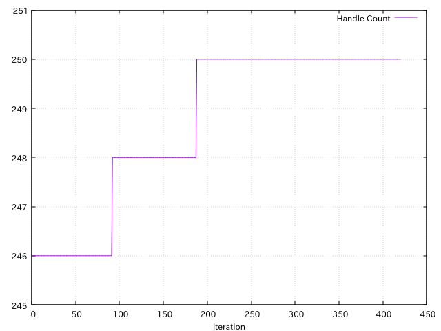
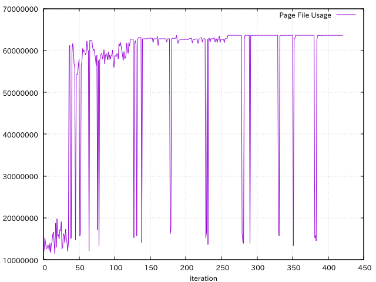

# Test program for [kubo/rust-oracle#13](https://github.com/kubo/rust-oracle/issues/13)

This program creates 30 connections and prints memory usage (and handle count on
Windows) iteratively. When no arguments are specified, connections are
established sequentially. When the `-t` argument is specified, connections are
established simultaneously using threads.

## Results on Linux

```
$ cargo run
    Finished dev [unoptimized + debuginfo] target(s) in 3.01s
     Running `target/debug/rust-oracle-issue-13`
VmSize(kB), VmRSS(kB)
120752, 23640
120752, 23640
120752, 23640
...

```

```
$ cargo run -- -t
    Finished dev [unoptimized + debuginfo] target(s) in 2.92s
     Running `target/debug/rust-oracle-issue-13 -t`
VmSize(kB), VmRSS(kB)
2123756, 41032
2123756, 47352
2123756, 47484
...
```

All `VmSize(kB)` values are same until 1000th line.
There are no memory leaks with and without `-t`.

## Results on Windows when connecting sequentially.

The next is the graph of handle count and page file bytes using [this data](seq-windows.txt).

 

It looks that there no resource leaks on Windows when connecting sequentially
because values don't increase after about one hundredth iteration.

## Results on Windows when connecting simultaneously using threads

Some defects are in [rust-oracle][], [ODPI-C][] or Oracle client library.
When this program runs with `-t` on Windows, it stops with the following error
after printing several dozens of lines.

```
S:\rust-oracle-issue-13>cargo run -- -t > thread-windows.txt
    Finished dev [unoptimized + debuginfo] target(s) in 1.06s
     Running `target\debug\rust-oracle-issue-13.exe -t`
error: process didn't exit successfully: `target\debug\rust-oracle-issue-13.exe -t` (exit code: 0xc0000409, STATUS_STACK_BUFFER_OVERRUN)
```

I got the following result after several attempts.

 

It looks that there are no memory leaks. However I'm not sure whether there are
handle leaks. If the number of handle count doesn't change in additional several
iterations, I consider that there are no handle leaks.

[rust-oracle]: https://github.com/kubo/rust-oracle
[ODPI-C]: https://oracle.github.io/odpi/
